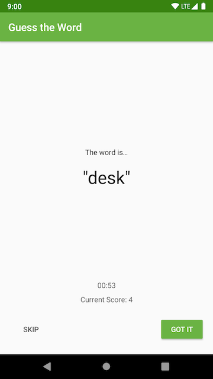

# Application Architecture - The UI Layer - Guess It!

## Guess It!

Guess It is a word guessing app you can play with one or more friends. To play, hold the device in landscape, facing away from you with your thumbs on the **Skip** and **Got It** buttons. Your friends can then give you clues to help you guess the word. 

If you get the word right, press **Got It**. If you're stuck, press **Skip**. The game runs for a minute and then shows you your score.

  
  <h3 align="center">About Me</h3>

  

    A Guessing game 
   on Android.
     
     
     
    

 

### Table of contents

**1 [About the App](#about-the-app)** 
**2 [General Preview](##general-preview)** 
**3 [Technical](#technical)** 
**4 [Work in Progress](#work-in-progress)** 
**5 [Contributing](#contributing)** 
**6 [License](#license)** 
**7 [Versions](#versions)** 
**8 [Contributers](#contributers)** 

:point_down: :point_down: :point_down: :point_down: :point_down:

# About the app

DessertPusher is a game about making desserts. Press the button, make a dessert, earn the big bucks.

This app is for exploring the [Activity Lifecycle callback methods](https://developer.android.com/guide/components/activities/activity-lifecycle) and the [Lifecycle](https://developer.android.com/reference/android/arch/lifecycle/Lifecycle) object.

## General Preview

#### Screenshots

  

## Technical

## Permissions

* Any permissions needed by the app i.e:

1. Internet
2. Browse phone

#### Running the project
You can:

    a. clone the project and compile it yourself in android studio(Most up to date)
    b. Run the already compiled version on the(the proect comes with an apk folderwith various apk versions).

### TECHNICAL

#### How to use

**1. Required to run project:**
       ` - To run this project use Android studio 3.* and later. It will be less messy.
         - Gradle version used: gradle 4.0. You can use multiple gradle versions vby having them stored offline. [You can read this to set it up.](www.sth)
        `

**2. Clone this repository :**
 
         `https://github.com/kevinmainairungu/andfun-kotlin-guess-it-starter-coder`
         
**3. open Project in Android Studio

**4. Build Project**

**5. Incase of an eror when building project, update your gradle version, Build Tools download**

#### Dependencies

## To Do List

- [x] Working with ViewModel
- [ ] SplashScreen
- [x] Binding data
- [x] Removed Fragment Logic to the ViewModel

#### CONTRIBUTING
### Assets
* Credit to artists(music,images,gifs...)

### List of the Contributors on GitHub
* [Contributors](https://github.com/kevinmainairungu/andfun-kotlin-guess-it-starter-code#about-the-app/graphs/contributors)

### Want to contribute?
I would/ We'd love to have your help in making  **{this app (About me)}** better. The project is still very incomplete, but if there's an issue you'd like to see addressed sooner rather than later, let me(/us) know. 

Before you contribute though read the contributing guide here: [COntributing.md](https://github.com/kevinmainairungu/andfun-kotlin-guess-it-starter-code#about-the-app/contributing.md)

For any concerns, please open an [issue](https://github.com/kevinmainairungu/andfun-kotlin-guess-it-starter-code#about-the-app/issues), or JUST, [fork the project and send a pull request{edit this}](https://github.com/kevinmainairungu/andfun-kotlin-guess-it-starter-code#about-the-app/pulls). 

## License 
* see [LICENSE](https://github.com/kevinmainairungu/andfun-kotlin-guess-it-starter-code#about-the-app/blob/master/LICENSE) file

## Versions 
* Version 1.0  DATE 4/6/2020

## Contributers
For personal feedback or questions feel free to contact me via the mail address, which is mentioned on my [Github profile](link (https://github.com/kevinmainairungu). If you have found any bugs or want to post a feature request please use the [bugtracker](https://github.com/kevinmainairungu/andfun-kotlin-guess-it-starter-code/issues) to report them.

#### Developer/Company
* Homepage:  
* e-mail: 
* Twitter: [@maina_irungu_](https://twitter.com/maina_irungu_ "maina_irungu_")
* other communication channels i.e Social Media, Forum etc

https://contributors-img.firebaseapp.com/

If its open source:

  

Licence is MIT:

